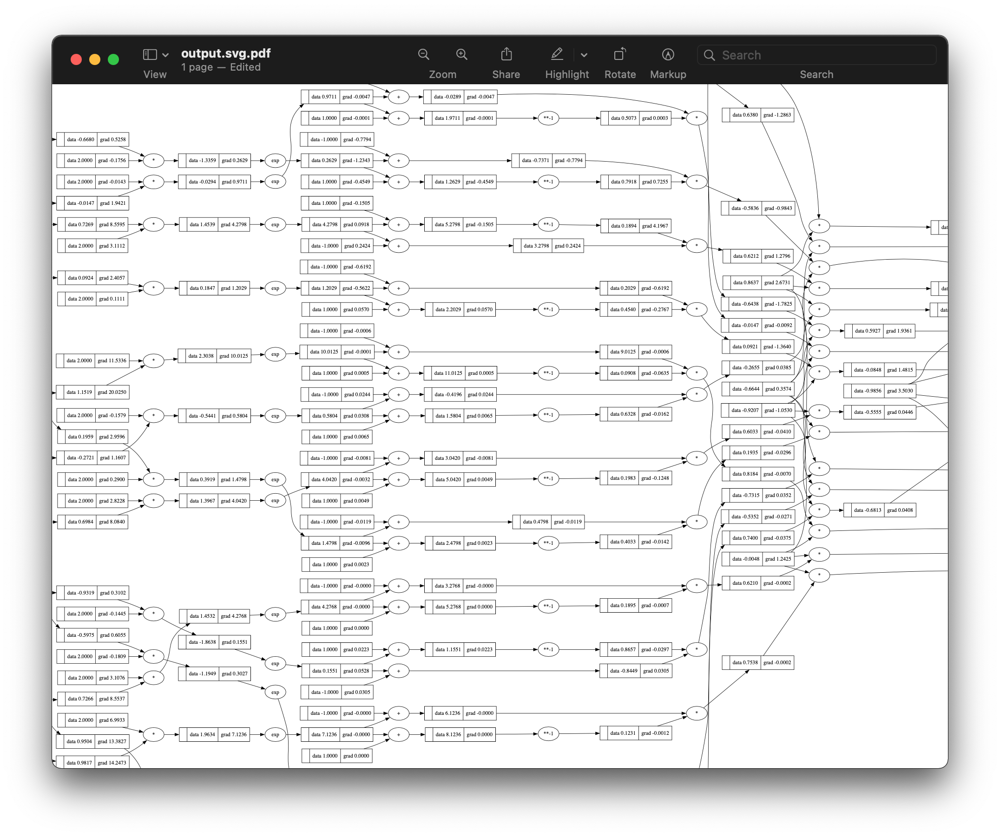

# Micrograd

### An educational toy implementation of PyTorch's autograd engine

A tiny Autograd engine that implements backpropagation (reverse-mode autodiff) and a small MLP library on top of it with a PyTorch-like API.
With only about 150 lines of code, the engine operates over scalar values,

